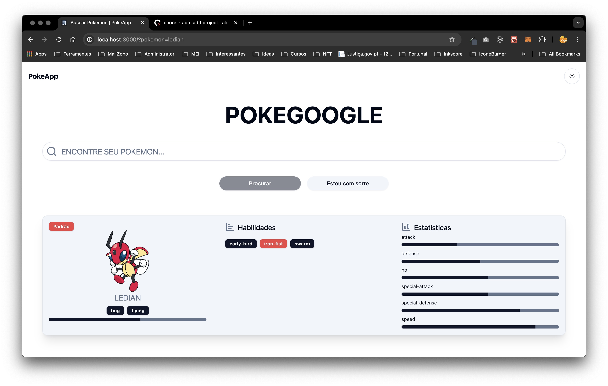
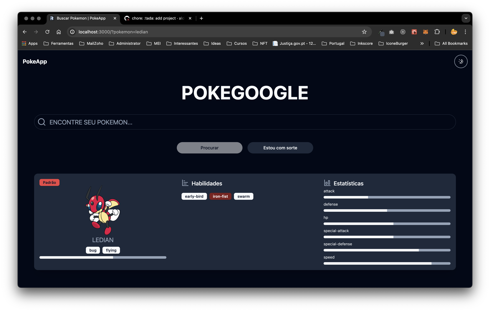

# Challenge ServerSide

    
    

---

## Descrição

Desafio ServerSide with frontend Remix.

---

## Visualizar o projeto na IDE:

Para quem quiser visualizar o projeto na IDE clique no teclado a tecla `ponto`, esse recurso do GitHub é bem bacana

## Como usar

- Clone o repositório;
- Instale as dependências com o comando `yarn`;
- Execute o comando `yarn dev` para executar;

  

  

